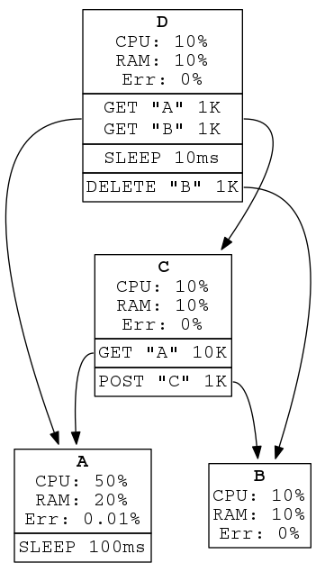

# Service Grapher

## service-graph.yaml

Describes a service graph to be tested which mocks a real world service-oriented
architecture.

### Full example

```yaml
apiVersion: v1alpha1
default:
  payloadSize: 1 KB
  computeUsage: 10%
  memoryUsage: 10%
services:
  A:
    computeUsage: 50%
    memoryUsage: 20%
    errorRate: 0.01%
    script:
    - sleep: 100ms
  B:
  C:
    script:
    - get:
        service: A
        payloadSize: 10K
    - post: B
  D:
    # Call A and C concurrently, process, then call B.
    script:
    - - get: A
      - get: C
    - sleep: 10ms
    - delete: B
```

Represents a service graph like:



Generates a Kubernetes manifest like: (TODO: Pretty sure I'm using ConfigMaps
incorrectly).

```yaml
apiVersion: v1
kind: ConfigMap
metadata:
  name: a-script
data:
  script:
  - sleep: 100ms
---
apiVersion: v1
kind: Service
metadata:
  name: A
spec:
  ports:
  - port: 80
    targetPort: 80
---
apiVersion: apps/v1
kind: Deployment
metadata:
  name: A
spec:
  replicas: 1
  template:
    spec:
      containers:
      - name: performance-test
        image: istio.gcr.io/performance-test
        ports:
        - containerPort: 80
        env:
        - name: SCRIPT
          valueFrom:
            configMapKeyRef:
              name: a-script
              key: A-SCRIPT
---
apiVersion: v1
kind: ConfigMap
metadata:
  name: b-script
data:
  script:
---
apiVersion: v1
kind: Service
metadata:
  name: B
spec:
  ports:
  - port: 80
    targetPort: 80
---
apiVersion: apps/v1
kind: Deployment
metadata:
  name: B
spec:
  replicas: 1
  template:
    spec:
      containers:
      - name: performance-test
        image: istio.gcr.io/performance-test
        ports:
        - containerPort: 80
        env:
        - name: SCRIPT
          valueFrom:
            configMapKeyRef:
              name: b-script
              key: B-SCRIPT
---
apiVersion: v1
kind: ConfigMap
metadata:
  name: c-script
data:
  script:
  - call: A
  - call: B
---
apiVersion: v1
kind: Service
metadata:
  name: C
spec:
  ports:
  - port: 80
    targetPort: 80
---
apiVersion: apps/v1
kind: Deployment
metadata:
  name: C
spec:
  replicas: 1
  template:
    spec:
      containers:
      - name: performance-test
        image: istio.gcr.io/performance-test
        ports:
        - containerPort: 80
        env:
        - name: SCRIPT
          valueFrom:
            configMapKeyRef:
              name: c-script
              key: C-SCRIPT
---
apiVersion: v1
kind: ConfigMap
metadata:
  name: d-script
data:
  script:
  - - call: A
    - call: C
  - sleep: 10ms
  - call: B
---
apiVersion: v1
kind: Service
metadata:
  name: D
spec:
  ports:
  - port: 80
    targetPort: 80
---
apiVersion: apps/v1
kind: Deployment
metadata:
  name: D
spec:
  replicas: 1
  template:
    spec:
      containers:
      - name: performance-test
        image: istio.gcr.io/performance-test
        ports:
        - containerPort: 80
        env:
        - name: SCRIPT
          valueFrom:
            configMapKeyRef:
              name: d-script
              key: D-SCRIPT
---
```

### Specification

```yaml
apiVersion: {{ Version }} # Required. K8s-like API version.
default: # Optional. Default to empty map.
  computeUsage: {{ Percentage }} # Optional. Default 0%.
  memoryUsage: {{ Percentage }} # Optional. Default 0%.
  errorRate: {{ Percentage }} # Optional. Default 0%.
  payloadSize: {{ DataSize }} # Optional. Default 0.
services: # Required. List of services in the graph.
  {{ ServiceName }}: # Required. Name of the service.
    computeUsage: {{ Percentage }} # Optional. Overrides default.
    memoryUsage: {{ Percentage }} # Optional. Overrides default.
    errorRate: {{ Percentage }} # Optional. Overrides default.
    script: {{ Script }} # Optional. See below for spec.
```

#### Default

At the global scope a `default` map may be placed to indicate settings which
should hold for omitted settings for its current and nested scopes.

Default-able settings include `computeUsage`, `memoryUsage`, `script`,
`requestSize`, and `errorRate`.

##### Example

```yaml
apiVersion: v1alpha1
default:
  computeUsage: 10%
  errorRate: 0.1%
  payloadSize: 100KB
  # memoryUsage: 0% # Inherited from default.
services:
  A:
    memoryUsage: 80%
    script:
    - get: B # payloadSize: 100KB # Inherited from default.
    - get:
        service: B
        payloadSize: 80B
    # computeUsage: 10% # Inherited from default.
    # errorRate: 10% # Inherited from default.
  B:
    errorRate: 5%
    # computeUsage: 10% # Inherited from default.
    # memoryUsage: 0% # Inherited from default.
    # script: {} # Inherited from default (acts like an echo server).
```

#### Script

`script` is a list of high level steps which run when the service is called.

Each step is executed sequentially and may contain either a single command or
a list of commands. If the step is a list of commands, each command in that
sub-list is executed concurrently (this effect is not recursive; there may
only be one level of nested lists).

The script is always _started when the service is called_ and _ends by
responding to the calling service_.

##### Commands

Each step in the script includes a command.

###### Sleep

`sleep`: Pauses for a duration. Useful for simulating processing time.

```yaml
sleep: {{ Duration }}
```

###### Send Request

`get`, `head`, `post`, `put`, `delete`, `connect`, `options`, `trace`,
`patch`: Sends the respective HTTP request to another service.

```yaml
{{ HttpMethod }}: {{ ServiceName }}
```

OR

```yaml
{{ HttpMethod }}:
  service: {{ ServiceName }}
  payloadSize: {{ DataSize (e.g. 1 KB) }}
```

##### Examples

Get B, then post to B _sequentially_:

```yaml
script:
- get: B
- post: B
```

GET A, B, and C _concurrently_, sleep to simulate work, and finally POST to D:

```yaml
script:
- - get: A
  - get: B
  - get: C
- sleep: 10ms
- post: D
```

## Architecture and pipeline

### 1. Parsing

A .yaml file is converted into a service graph data structure which is then
output as a Kubernetes manifest. However, another tool could be used to
generate Consul artifacts instead, for example.

### 2. Setup

A testing cluster is preexistent, with the desired "level" of Istio already
installed. Therefore, the manifest only needs to be applied to the cluster via
`kubectl apply`.

Each pod in the manifest will be running the same container image (except the
Istio images). A client will send requests to each service with their
instructions for the duration of the test (TODO: unless there is some way to
include data in the manifest, then this could be done at the manifest level).

### 3. Test

Should send requests to every leaf in the tree (i.e. C, D).

Each node should be monitored by its CPU and memory usage and by latencies of
each request.
